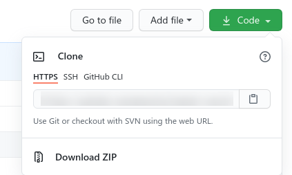

# Teets Search

**Tweet Search** es una conexión a la **API de Twitter** para mostrar Tweets relacionados con un hastash en particular. Luego estos tweets se pueden mostrar directamente en las entradas o articulos del sitio.

## Instalación

Para instalar el plugin, primero debe clonarlo o descargarlo de este repositorio:

[https://github.com/matezito/tweets-search](https://github.com/matezito/tweets-search)

Clonar:

`git clone https://github.com/matezito/tweets-search`

Descargar: en la pestaña code boton code (verde) del repositorio, descargar desde **Download ZIP** como se muestra en la imagen:

