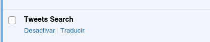
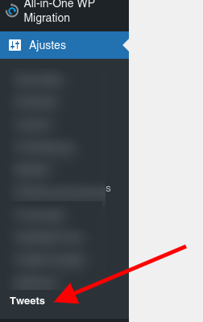
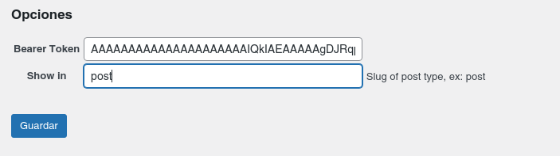
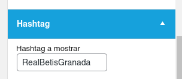

# Tweets Search

[Docs Español](#spanish) | [Docs English](#english)

**Intro Español**

Este plugin fue desarrollado como parte de una estrategia **Open Source** para medios de todo el mundo basada en el CMS **WordPress**.  
Haciendo click en este [enlace](https://tiempoar.com.ar/proyecto-colaborativo/) se puede encontrar más información sobre el proyecto, así como las lista de plugins que complementan a este para tener un sitio completamente funcional.

**English introduction**

This plugin was developed as part of an **Open Source** strategy for worldwide media based on the CMS **WordPress**.
By clicking on this [link](https://tiempoar.com.ar/proyecto-colaborativo/) you can find more information about the project, as well as the list of complements that complement it to have a fully functional site.

### <a name="spanish">Docs Español</a>

**Tweet Search** es una conexión a la **API de Twitter** para mostrar Tweets relacionados con un hastash en particular. Luego estos tweets se pueden mostrar directamente en las entradas o articulos del sitio.

## Instalación

Para instalar el plugin, primero debe clonarlo o descargarlo de este repositorio:

[https://github.com/matezito/tweets-search](https://github.com/matezito/tweets-search)

Clonar:

`git clone https://github.com/matezito/tweets-search`

Descargar: en la pestaña code boton code (verde) del repositorio, descargar desde **Download ZIP** como se muestra en la imagen:


 Una vez clonado o descargado, se debe mover la carpeta **tweets-search** al directorio **`wp-content/plugins`** de su instalación de Wordpress. 

 **IMPORTANTE** Tenga en cuenta que la carpeta **tweets-search-main** debe ser renombrada a **tweets-search** o puede haber problemas con la instalación.

 Una vez que se descomprime y renombra la carpeta, nos dirigimos a la lista de plugins, buscamos **Tweets Search** y lo activamos.



Más información sobre manejo de plugins (en Inglés): [Wordpress Codex](https://wordpress.org/support/article/managing-plugins/)

## Configuración

Para configurar el plugin necesitamos la **Bearer Token** de desarrollador de Twitter.  
Para obtener la **Bearer Token** debe aplicar para una cuenta de desarrollo, en la siguiente página:  
[https://developer.twitter.com/en/apply-for-access](https://developer.twitter.com/en/apply-for-access)

Una vez obtenida la **Bearer Token**, se debe configurar el plugin en **Ajustes** > **Tweets** 
  
Una vez que ingresamos a este menú, vemos la siguiente pantalla:  
  
En el campo con la etiqueta **Bearer Token**, agregamos el token generado en la cuenta de desarrollo.  
En el campo con la etiqueta **Show in**, incluimos el slug del post type donde vamos a mostrar los tweets. Por ejemplo, en este caso, mostramos los tweets en las Entradas.

La siguiente parte de la configuración se realiza en las entradas individuales que vayamos creando, en el menú de la columna derecha de cada entrada, con el plugin activo, encontramos el campo **Hashtag**:  
  
En este campo agregamos el hashtag del cual vamos a mostrar tweets sin el signo **#** (numera o almohadilla).

Con esta configuración realizada, ya podemos mostrar los tweets dentro de la entrada que necesitemos. Cabe aclarar que se puede usar solo en la entrada en que fue configurado.

## Mostrar Tweets en Front

Para mostrar la lista de Tweets en el front, debemos agregar el siguiente código php al single.php de nuestro theme principal (o child theme).  

```PHP
<?php
if (function_exists('tweets_search_front')) { 
    echo tweets_search_front()->get_tweets(get_queried_object_id());
}
?>
```

Se puede agregar este código dentro de un función a llamar desde un **action** de Wordpress de ser necesario.


 ### <a name="english">Docs English</a>